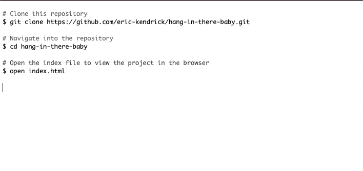

# Hang in There  

### Abstract:
  Hang In There is a dynamic web application that displays customizable inspirational posters on the web page. It offers features that allow the user to generate random poster images, titles and quotes from a catalog of existing examples as well as allowing the user to create their own poster from scratch. Additionally, the user can save created posters to a saved gallery. 

### Installation Instructions:
  To clone and run this application you will need [Git](https://git-scm.com/) installed on your computer. No dependencies are required for program execution.

  

### Preview of App:

https://github.com/eric-kendrick/hang-in-there-baby/assets/45040241/1ba1e813-7286-429c-b9d0-bf3ae54fbe38

### Context:
  Hang in There is the first paired project in Module 1 of Turing's front-end engineering program, and the project scope required the application to be delivered within five days. The project was completed utilizing HTML, CSS, and Javascript without a library.

### Contributors:
* Gavin Garcia
  [Gavin's GitHub](https://github.com/EGavinG)
* Eric Kendrick
  [Eric's GitHub](https://github.com/eric-kendrick)

### Learning Goals:
  The learning goals of this project were to utilize our collaboration skills and knowledge of the link between HTML, CSS, and Javascript to accomplish the following - 
  * Write clean, DRY Javascript
    * Build out functionality using functions that show trends toward single-responsibility principles 
    * Manipulate the page after it has loaded adding, removing, and updating elements on the DOM
  * Begin to understand the connection between HTML, CSS, and Javascript
    * Practice reading, understanding, and using provided code
  * Build an understanding of writing code collaboratively
    * Document changes with atomic commits & thorough code reviews
    * Communicate, troubleshoot, and plan effectively as a team
    * Ensure all team members are able to be heard and contribute throughout the project

### Wins + Challenges:
  This was the first pairing project for this course, and our team successfully committed to our DTR and norming document as we iterated through the project. Collaboration and communication were paramount throughtout, and we maintained a successful workflow through each iteration. Additionally, we galvanized our knowledge of DOM manipulation as we worked through the problem to provide a dynamic, functional deliverable. 
